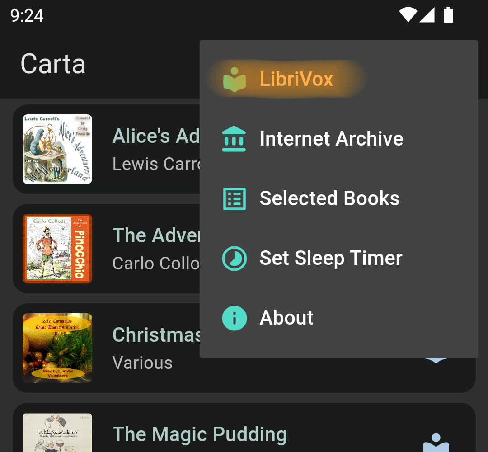
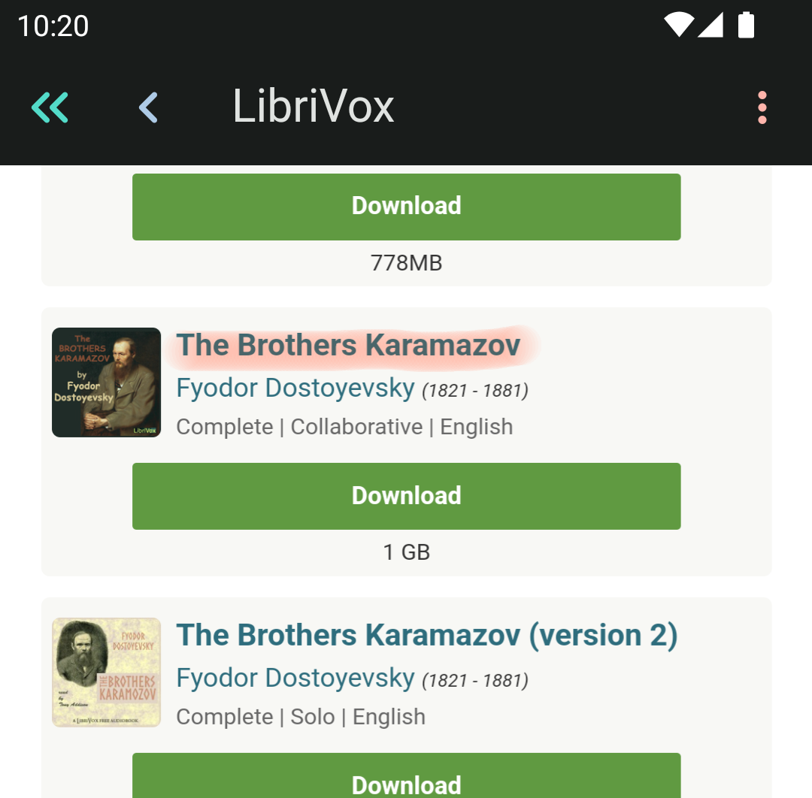
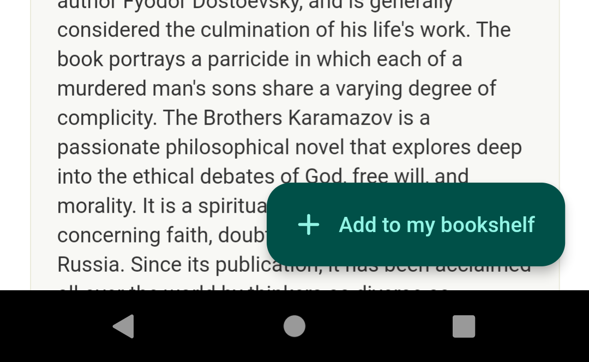
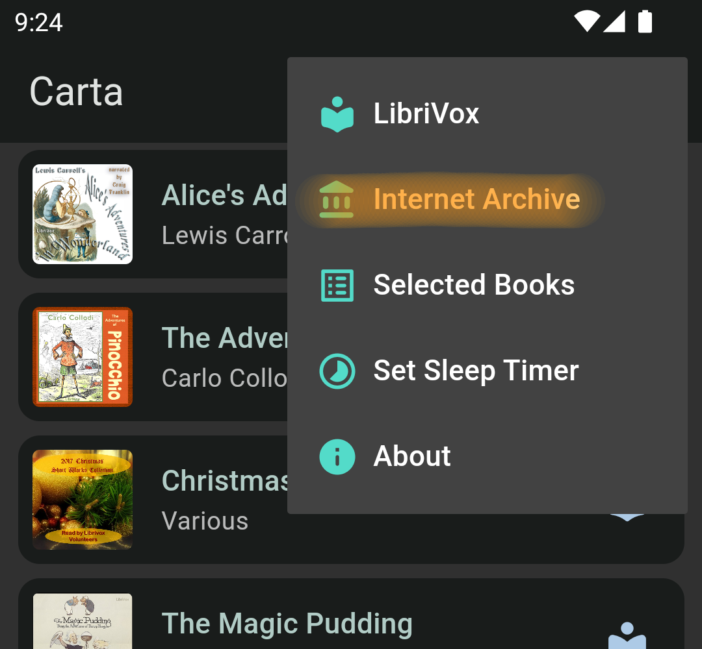
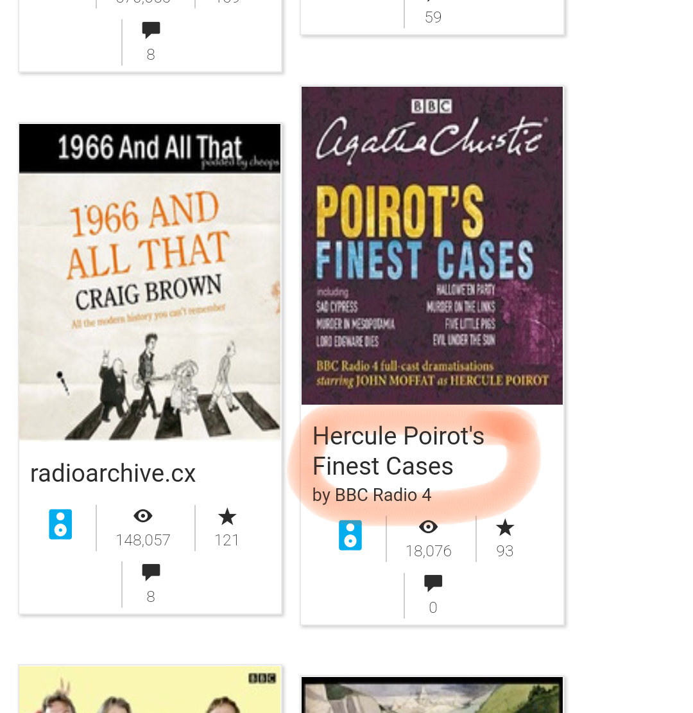
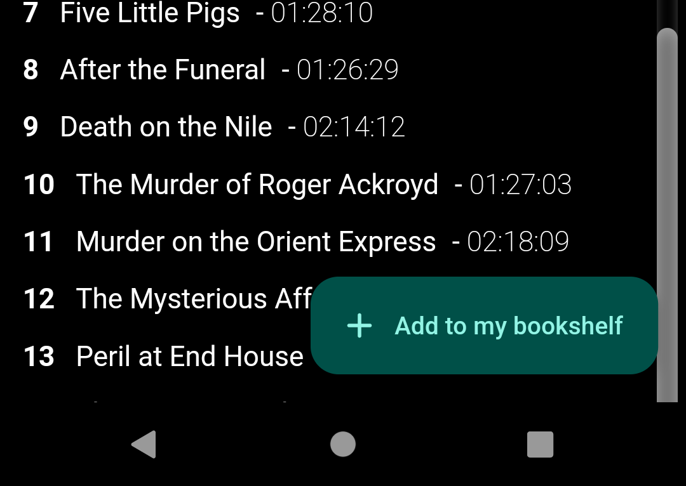
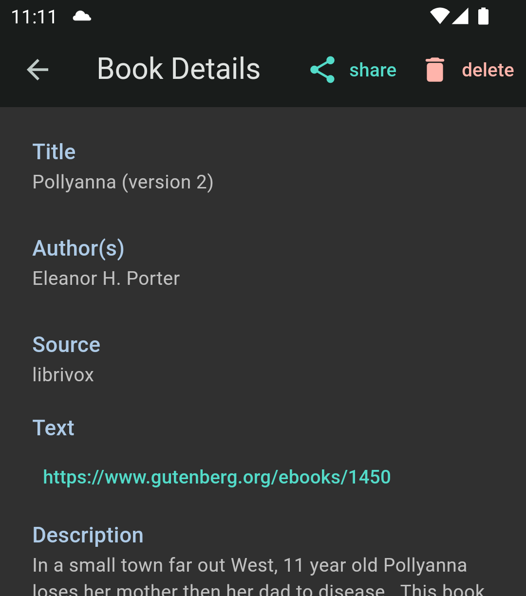
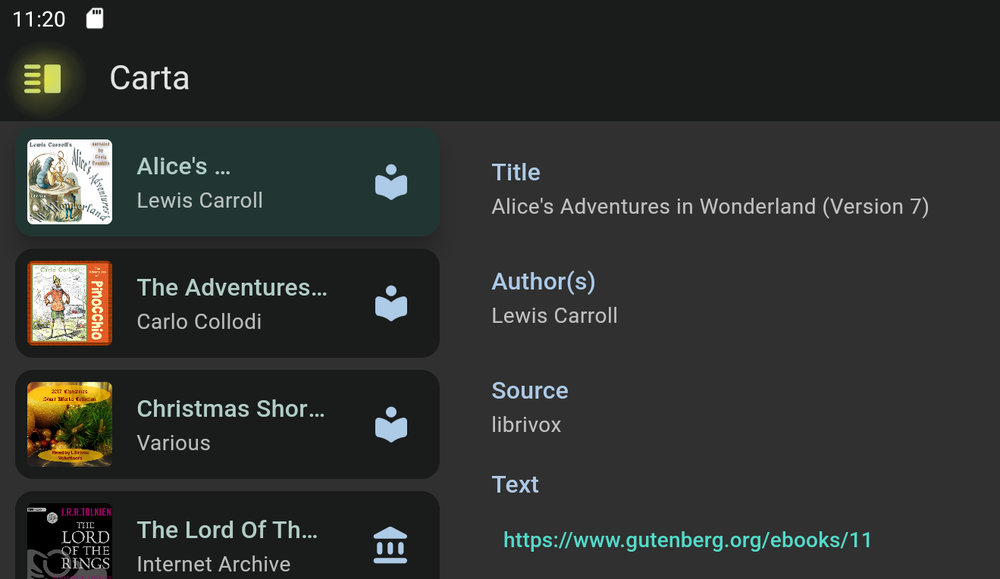
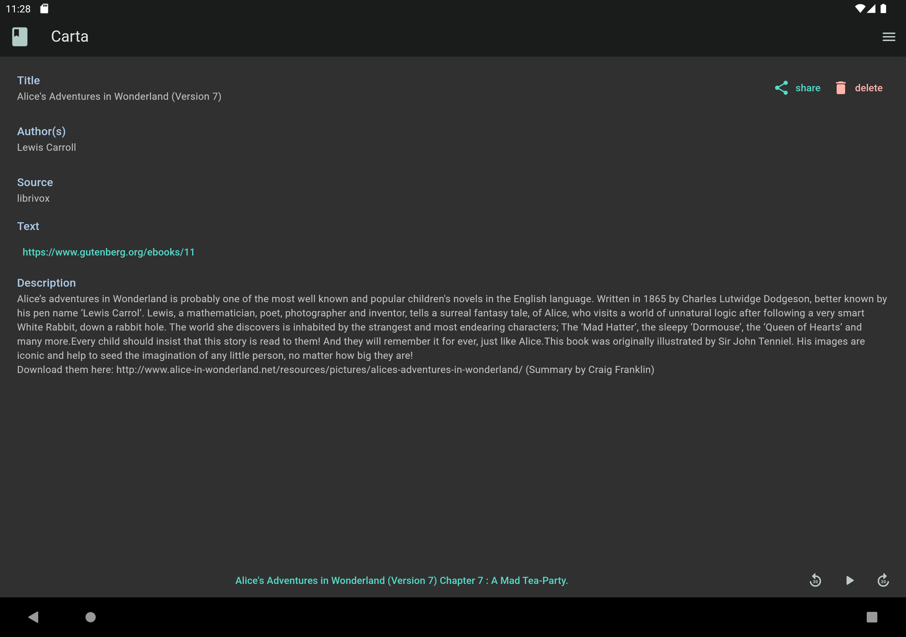

# Instruction

* [Add Audiobooks from LibriVox](#add-audiobooks-from-librivox)
* [Add Radio Shows from Internet Archive](#add-radio-shows-from-internet-archive)
* [Share Books, Delete Books](#share-books-delete-books)
* [Use Wide Screen Devices (Tablets and Chromebooks)](#use-wide-screen-devices-tablets-chromebooks)
* [Read Book Text](#read-book-text)

## Add Audiobooks from LibriVox

* From the menu at the top right corner of the home screen,
select ***LibriVox***

{: style="width:400px"}

* Search books using Web UI

{: style="width:400px"}

* Select the book you want and head over to the book page

{: style="width:400px"}

* Find ***+ Add to my bookshelf*** button at the bottom and tap it

{: style="width:400px"}

* Return to home screen by tapping **<<** button at the top

## Add Radio Shows from Internet Archive

* From the menu at the top right corner of the home screen,
select ***Internet Archive***

{: style="width:400px"}

* From the menu at the top right corner of the screen, select
***BBC Radio Shows***

{: style="width:400px"}

* Choose the item you want and head over to the details page

{: style="width:400px"}

* Find ***+ Add to my bookshelf*** button at the bottom and tap it

{: style="width:400px"}

## Share Books, Delete Books

* Tap the icon at the right end of the book and go to the details page

{: style="width:400px"}

* In the book details page, find ***share*** button and ***delete*** button

{: style="width:400px"}

## Use Wide Screen Devices (Tablets, Chromebooks)

* App shows book list on the left, book details on the right by default

{: style="width:800px"}

* You can switch between split view and book only view using the button
at the top left corner

{: style="width:400px"}

* Book only view is useful when you read book text

{: style="width:800px"}

## Read Book Text

* In the book details page find Text URL and tap it

{: style="width:400px"}

* In most cases, it will lead you to the [Gutenberg Project](https://gutenberg.org/) site.
* Find ***Read this book online*** link and click it

{: style="width:400px"}

Note that

* Most smartphones are too small to read text
* Materials from Internet Archive have no text
* Some audio books from LibriVox have no accompanying text
