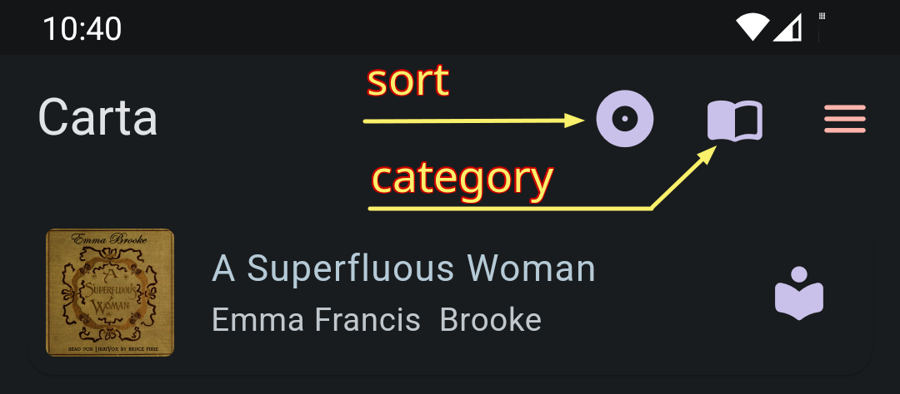

# Instruction

## Buttons, Menus, Screens

At the top, from the left you have three buttons:

* Sort: sort books by title or author name
* Cartegory: show books by the source
* Menu: sleep timer, manual, settings, ...

{: style="width:400px"}

At the bottom, you have

* Add audiobook button
* Audio player (tab to expand)

{: style="width:400px"}

On each book title, there is a book info button at the right end.
The shape of the icon indicates the source of the book.

{: style="width:400px"}

There you can find detailed information about the book. You can 
edit some items including cover image URL, book text URL, and book description.
You can also delete the book here.

{: style="width:400px"}

## Add Audiobooks

Tap the **+** button at the bottom and select a book source

{: style="width:400px"}

### LibroVox, Internet Archive, Legamus

You can navigate these sites using the internal browser. You can also use the 
menu at the top right corner for some popular choices.

{: style="width:400px"}

Once, you get to the book page you want, you will see **Add to my bookself** 
button poped up at the bottom

{: style="width:400px"}

### Cloud WebDAV Server

If you choose **Cloud WebDAV Server**, you will be brought to the **Settings** 
page where you can register your WebDAV server

{: style="width:400px"}

#### Nextcloud sample

{: style="width:400px"}

Nextcloud has unique url for the WebDAV access. Go to your nextcloud console
and check **Files > Files settings > WebDAV** page.
As it is notified in the page, if you enabled 2FA, you need to use app specific password instead of your account password.
Also visit [this page](https://docs.nextcloud.com/server/stable/user_manual/en/files/access_webdav.html)
for further information.

#### Koofr Cloud Sample

{: style="width:400px"}

Koofr also require you to use app password instead of account password.
Visit your Koofr web console and proceed to **Account > Preferences > Password** page, there you can generate a password for the app use.

#### Other Types of WebDAV Servers

This app has been tested with 
[Apache mod_dav](https://httpd.apache.org/docs/2.4/mod/mod_dav.html) 
and [rclone serve.](https://rclone.org/commands/rclone_serve_webdav/)
However it should work with other types of WebDAV servers too.

{: style="width:400px"}

In this case, actual url depends on the configuration of the server.

After setting up servers, you can access them through the **+** menu.

{: style="width:400px"}

## Set Up a WebDAV Server

If you are new to WebDAV, visit [this page for easy setup](https://github.com/innomatica/carta/tree/master/extra/webdav)

## On Tablets and Chromebooks

On wide screen devices, app shows book list on the left, book details on the right by default.

{: style="width:800px"}

You can switch between split view and book details only view using the button
at the top left corner. Book details only view is useful when you read the book text.

### Access Book Text

In the book details page find Text URL and tap it

{: style="width:400px"}

In most cases, it will lead you to the [Gutenberg Project](https://gutenberg.org/) site.
Find ***Read this book online*** link there.

{: style="width:400px"}

You will be able to read the text while listening to the audio

{: style="width:800px"}

Note that

* Most smartphones are too small to read text
* Materials from Internet Archive have no text
* Some audio books from LibriVox have no text
